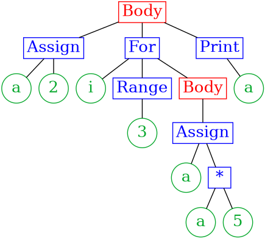

# AST Example

<figcaption><b>Arbre 2 : Arbre de Jeu (de Nim)</b></figcaption>

```dot
graph Code {
  size="2.9"
  node [penwidth=2, fontsize=38]
  edge [penwidth=2]
  {i, Range, Body2, a2}
  Body1, Body2, Assign1, Assign2, For, Print, Range, "\*" [shape=rectangle]
  Body1, Body2 [label="Body", color=red, fontcolor=red]
  Assign1, Assign2, For, Print, Range, "\*" [color=blue, fontcolor=blue]
  Assign1, Assign2 [label="Assign"]
  i, a1, a2, a3, a4, 2, 5, 3 [color="#08a82d", fontcolor="#08a82d", shape=circle]
  a1, a2, a3, a4 [label="a"]
  Body1 -- {Assign1, For, Print}
  Assign1 -- {a1, 2}
  For -- {i, Range, Body2}
  Range -- 3
  Body2 -- Assign2
  Assign2 -- {a2, "\*"}
  "\*" -- {a3, 5}
  Print -- a4
}
```
