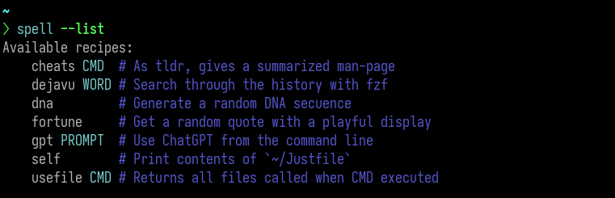
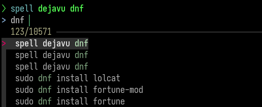
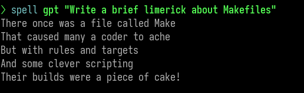
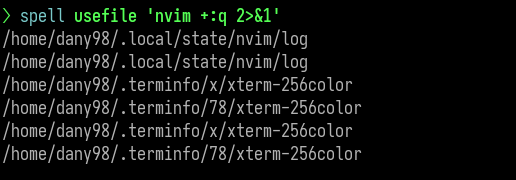
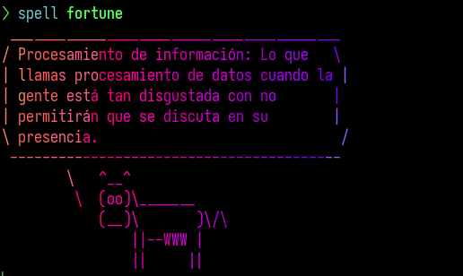

# 💡 Just harness Command-Line spells! 💫

Do your genius command-line ideas wander aimlessly without a home? Fear not,
for [`just`](https://github.com/casey/just) is here to save the day! While
tools like `make` excel at build automation, `just` takes a different approach
by focusing on human-readable command execution. In this tutorial, we'll use it
to set up a workflow to effortlessly capture, organize, and execute your
oneliner commands in a clean and concise manner. Let's embark on this adventure
and bring your command-line brilliance to life! 🌟

## Justfile

To install `just` follow the official
[instructions](https://github.com/casey/just#installation).

The easiest way to install it is with [`gh`](https://github.com/cli/cli) (the
Github CLI) and its extension
[`install`](https://github.com/redraw/gh-install). Install them and then run
the following to install `just` at `$HOME/.local/bin`:

```bash
gh install casey/just
```

Then add the following lines to your `shell` config file to create an alias, so
you don't mess with `just` if you use it for other projects.

```bash
# For Bash at ~/.bashrc
alias spell="just --justfile ~/Justfile"

# For Nushell at ~/.config/nushell/config.nu
alias spell = just --justfile ~/Justfile
```

Now, a basic `Justfile` could look like this. Very similar to a `Makefile` with
a simplified syntax.

```makefile
set shell := ["bash", "-c"]

# Print the contents of `~/Justfile`
self:
    bat --plain -n --language=make ~/Justfile
```

One of the best parts of using `just` is that the comments above each snippet
generates its own documentation :D As you can see, it's possible to add
arguments for each command.



## Suggested Justfile

The following is my personal `Justfile` where I keep my occasional and funny
occurrences. I located it at `$HOME/`. Also, this example may give a fair idea
of the possibilities of `just`, as argument handling, optional arguments and
command pipelines. Use it as an inspiration! 🤓

```makefile
set shell := ["bash", "-c"]

# Print contents of `~/Justfile`
self:
    bat --plain -n --language=make ~/Justfile

# Generate a random DNA sequence
dna:
    @cat /dev/urandom | tr -dc 'AGCT' | fold -w 32 | head -n 5

# Get a random quote with a playful display
fortune:
  @fortune -s | trans --brief en:es \
    | tee >(cowsay -f "$(ls /usr/share/cowsay/cows | sort -R | head -1)" | lolcat --random >/dev/tty) \
    | espeak -v spanish -k20

# As tldr, gives a summarized man-page
cheats CMD:
    @curl -sS cheat.sh/{{CMD}} | bat --style=plain

# Returns all files called when CMD is executed
usefile CMD:
  strace {{CMD}} 2>&1 | grep "^openat.*$HOME" | sed 's/.*"\(.*\)".*/\1/'

# Search through the history with fzf
dejavu WORD:
  @# @nushell -c "history" -m light | awk '{$1=""}1' \# Replace the below line if you use Nushell
  @history | awk '{$1=""; print $0}' | sort | uniq \
    | fzf --tac --layout=reverse --height=40% +s -e -q "{{WORD}}"

# Use ChatGPT from the command line
gpt PROMPT:
  @podman run --rm \
    --env OPENAI_API_KEY="YOUR_PERSONAL_TOKEN" \
    --volume gpt-cache:/tmp/shell_gpt ghcr.io/ther1d/shell_gpt "{{PROMPT}}"
```

Now you'll have a convenient place where to put all those pilgrim ideas







## Conclusion

In the previous `Justfile` I've used a couple of commands that I encorage you
to checkout ✨:

* [`bat`](https://github.com/sharkdp/bat) A `cat(1)` clone with wings
* [`lolcat`](https://github.com/busyloop/lolcat) Rainbows and unicorns!
* [`fzf`](https://github.com/junegunn/fzf) A command-line fuzzy finder
* [`espeak`](https://github.com/espeak-ng/espeak-ng) A speech synthesizer   
* [`podman`](https://podman.io/) A daemonless tool to manage containers
    
Hope you've enjoyed this tutorial. For further details the `just` official
docs. Happy scripting!

